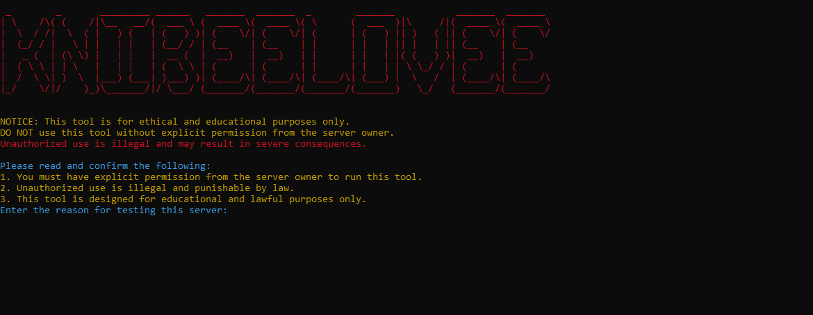
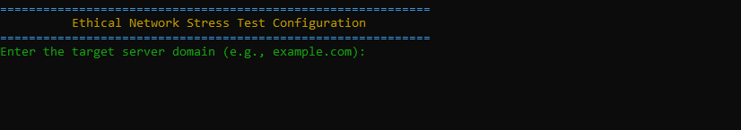

# Ethical Network Stress Test Tool

## Overview

The **Ethical Network Stress Test Tool** is a software solution designed for simulating network traffic to assess server performance. It sends controlled UDP packets to a target server for a specified period to simulate stress under high traffic conditions. The tool is designed to test the server's resilience and identify potential bottlenecks in the network.

## Important:

This tool is strictly for **ethical and educational purposes only**. It is intended for use on servers where you have **explicit permission** from the server administrator to perform stress tests. Unauthorized use of this tool is **illegal** and may result in **legal consequences**.

## Features

- **Simulated Network Traffic**: Simulates multiple bots sending packets to the target server.
- **Customizable Test Parameters**: Allows you to set the number of bots, target server IP/port, and the duration of the test.
- **Rate Limiting**: Controls the rate of requests per bot to prevent overwhelming the network.
- **Multithreading Support**: Uses multithreading to simulate multiple bots concurrently for a more accurate load test.
- **Ethical Use**: Emphasizes ethical testing, ensuring that the user has permission to test the target server.

## Images

 

 
 
 

---

## Ethical and Legal Responsibility

### Before You Use This Tool:

The following guidelines and responsibilities are critical to ensure you use this tool in an ethical and legal manner. **Failure to adhere to these guidelines may result in severe consequences, including legal action.**

1. **Explicit Permission**:
   - **You must have explicit, written permission from the server owner or administrator** to run this tool on their server. Testing without permission is illegal and considered a violation of computer network laws.
   - Running this tool on unauthorized servers may result in **criminal prosecution, civil lawsuits, and significant fines**. It is your responsibility to verify that you have received permission before conducting any tests.

2. **Educational Purposes**:
   - This tool is strictly intended for **educational purposes** or in a **controlled environment** where the server is specifically set up to undergo stress testing. It should never be used for malicious activities, including but not limited to:
     - Denial of Service (DoS) attacks
     - Distributed Denial of Service (DDoS) attacks
     - Disrupting the availability of services
     - Any form of cyber attack or unauthorized access
   - **Misuse of this tool** may lead to criminal charges, including hacking and network disruption.

3. **Malicious Use**:
   - **Do not use this tool to overwhelm or damage servers without permission.**
   - **Using this tool for malicious activities such as unauthorized testing, hacking, or cyber vandalism is strictly prohibited.**
   - If used to disrupt public services or interfere with networks without consent, **legal actions** will be taken against the user.

4. **Do Not Overwhelm Public Servers**:
   - Always ensure that the server you are testing is **prepared** and capable of handling stress tests.
   - Never run this tool on **public servers**, **production environments**, or any servers that are **not specifically set up** for testing purposes. Overloading or harming a public server can impact other users and cause significant disruption to service.

5. **Respect for Privacy and Confidentiality**:
   - Ensure that you do not inadvertently test or interact with servers that contain sensitive information or data that you do not have permission to access.
   - **Do not test on any server that holds private, classified, or proprietary data** unless you have clear and explicit consent from the rightful owner.
  
 ## Packages needed !

pip install colorama os

---

### Legal Disclaimer

By using this tool, you acknowledge that:

- **The author(s) of this tool, including any contributors, will not be held liable for any damages**, losses, or consequences arising from the use or misuse of the tool.
- You are solely responsible for **complying with all applicable laws and regulations** governing the use of this tool, including **local, state, national**, and **international laws**.
- **The author(s)** are not responsible for any misuse or unauthorized use of this tool, including the consequences of **illegal testing** or **cyber attacks** conducted by users of the tool.

### Liability and Risk

- This tool is **provided "as-is"** without warranties of any kind, either express or implied. The author(s) **disclaim any responsibility** for any direct or indirect damages that may arise as a result of the tool's use or misuse.
- **You accept full responsibility** for your actions when using this tool, and **any violation of these terms may result in civil or criminal consequences**.

---

## License

This project is licensed under the **Apache License, Version 2.0** (the "License"). You may not use this file except in compliance with the License. You may obtain a copy of the License at:

http://www.apache.org/licenses/LICENSE-2.0

Unless required by applicable law or agreed to in writing, software distributed under the License is distributed on an "AS IS" BASIS, WITHOUT WARRANTIES OR CONDITIONS OF ANY KIND. See the License for the specific language governing permissions and limitations under the License.
